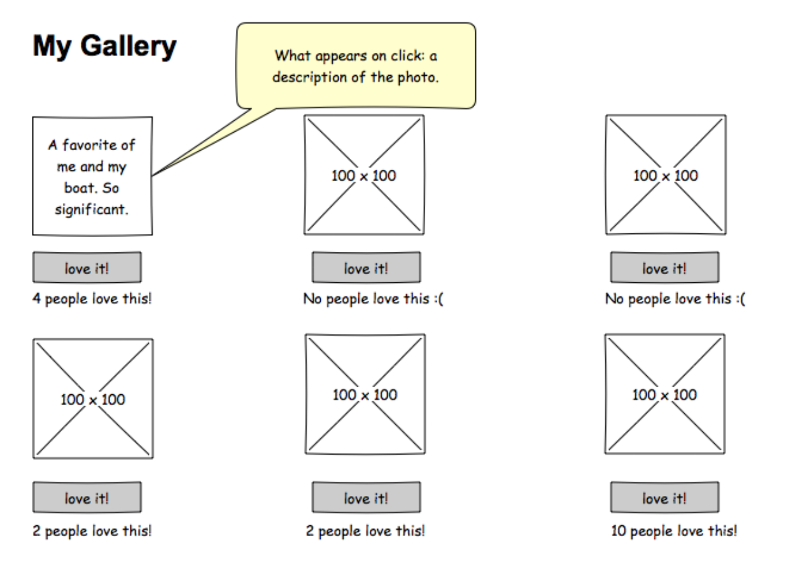

# Live Solve

- build out html/css ui
- get layout working in app component
- move card to dumb component

- put mock data into app component, state
  - update render for a list of cards
  - image still defined in the card as a variable as there is no static server yet
  - remember this.props.cardDetails.whatever!

- move cards to CardList component

- get behaviors working - data flowing 
  - onclick for show/hide text
- break down into further components?    

- get data from server to replace mock data
  - install axios

- like to server
- refresh data


# React - Gallery of My Life

Before you get started make sure to look through the code that has been provided. Server side code to retrieve data (`GET`) and like a photo (`PUT`) have been provided for you. For practice, we recommend testing out these routes in Postman. You should not need to modify these routes for base mode.

### Setup

There is no database component to base mode. All data is stored in an array on the server. Before you get started, add a few images to the `public/images` folder and modify the `server/modules/data.js` to include an `id`, `title`, `description` and `path for` each of your images. Each `id` should be a unique number (e.g. 1, 2, 3...).

Running the server code requires `nodemon`. If you don't already have `nodemon`, install it globally with `npm install nodemon --global`.

```
npm install
npm run server
```

Now that the server is running, open a new terminal tab with `cmd + t` and start the react client app.

```
npm run client
```

Between the server and client, you'll need two terminal tabs! Because we're using `nodemon`, both our client side and server side will automatically spin back up when changes are made!

## BASE MODE

- Use `axios` to retrieve (`GET`) data from to `/gallery` and store it in `App.js`.
- Create a new **component** called `GalleryItem.js` and pass it the individual gallery items via `props`. 
- Display all of the images on the screen along with the title.
- Swap the image with the description on click.
- Display the number likes for each item and include a like button.
- When the like button is clicked, use `Axios` to update (`PUT`) the like count `/gallery/like/:id`.
- Update the gallery each time a like button is clicked.

### Wireframes

> NOTE: Images don't need to be 100px x 100px but it will be easier if the are all the same dimensions.




## STRETCH GOALS

**Do not start on stretch goals until ALL of base mode is complete. Some of these will require additional research.**

- Add styling with Material-UI [https://material-ui-next.com/](https://material-ui-next.com/)
- Create a new **component** for the `GalleryList`
- Move the data into a database (either mongo or postgresql)
- Add a form (new **compontent**) that allows a user to POST a new gallery item
  - Client side form (use absolute URL for images)
  - Server side route for posting an image
- Ability to delete a gallery item
- Implement [file stack](https://www.filestack.com/) for image upload 

> NOTE: The above stretch goals are intended to be completed in order.